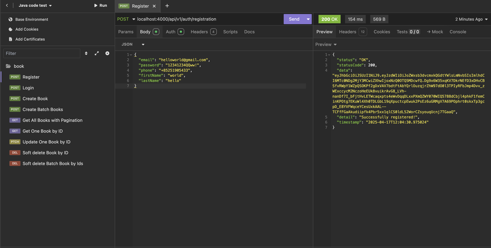
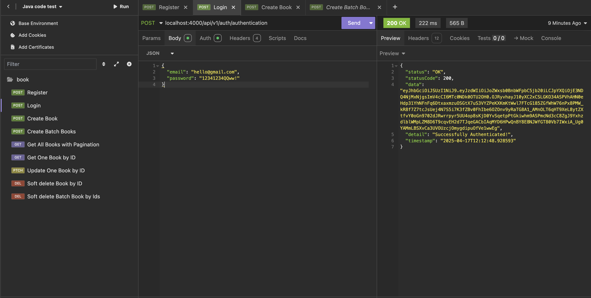
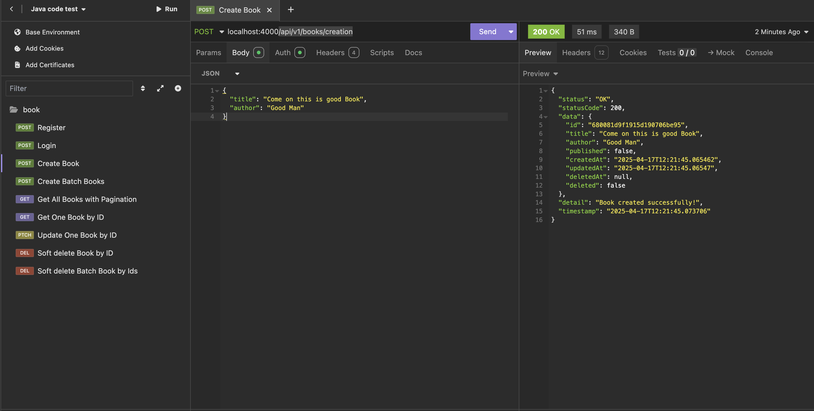
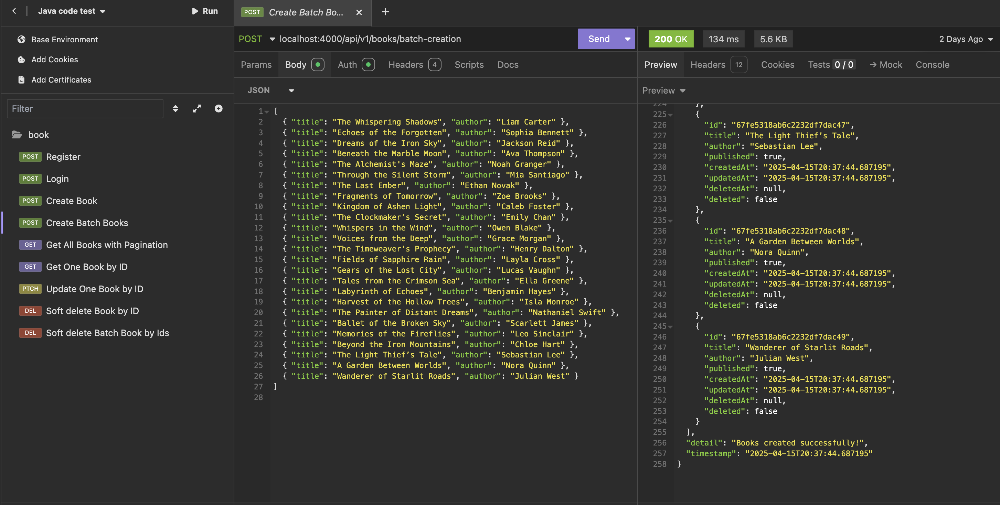
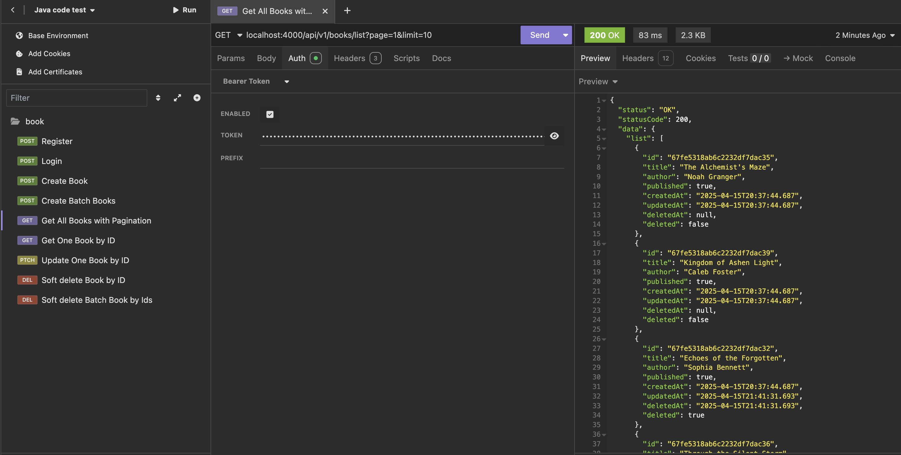
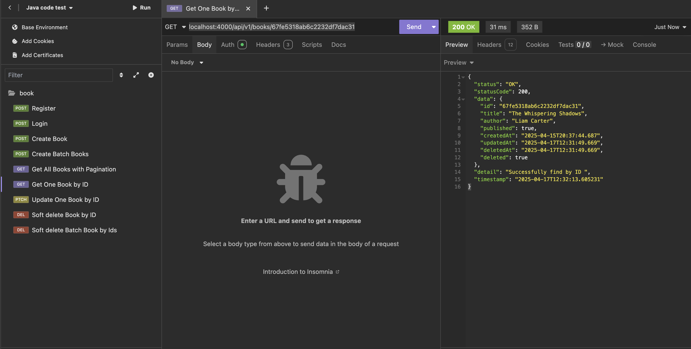
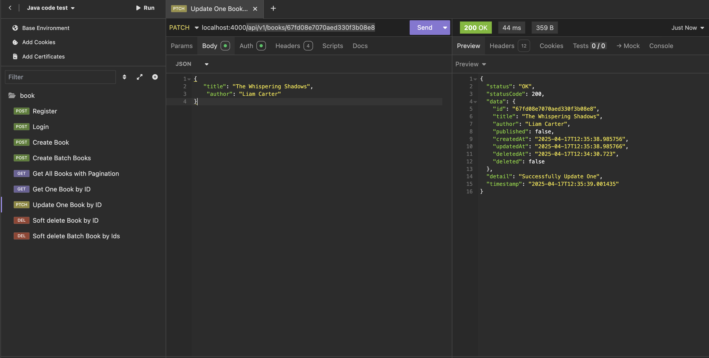
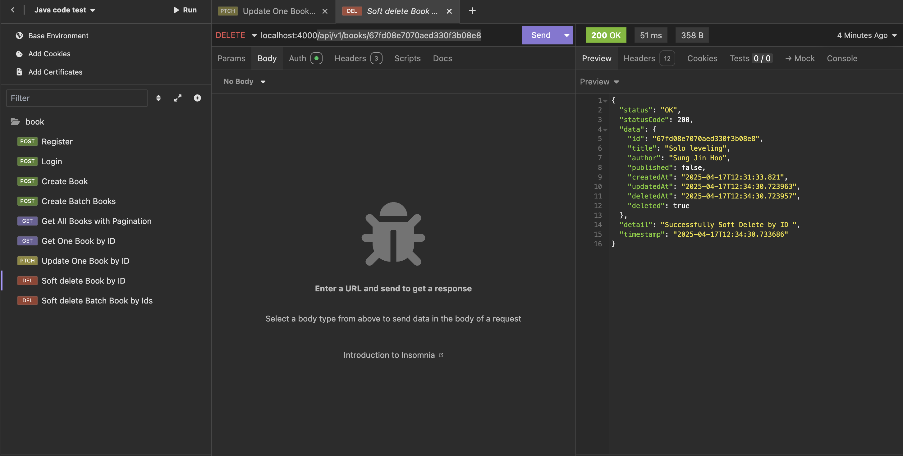
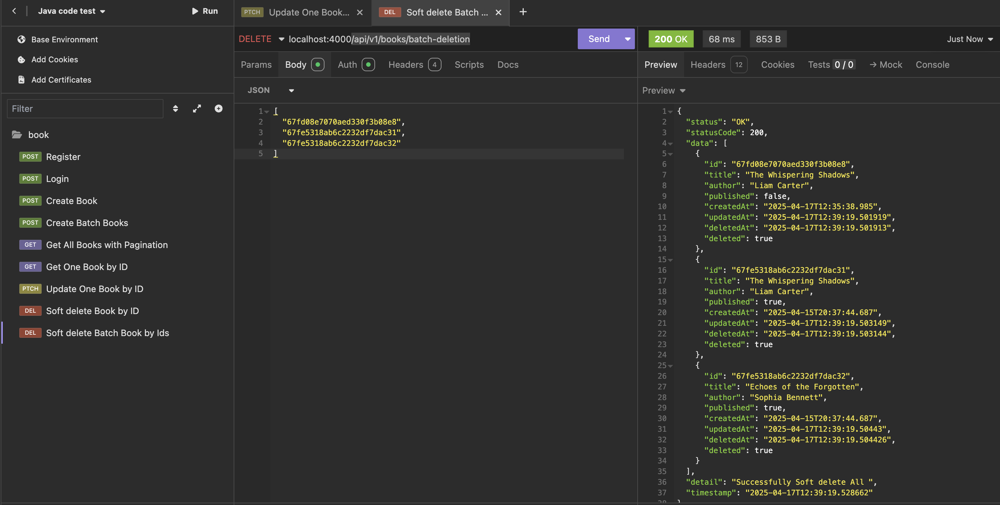

## 🔧 Configuration

Create or edit the `src/main/resources/application.properties` file with the following content:

```properties
# MongoDB Configuration
spring.data.mongodb.host=localhost
spring.data.mongodb.port=27017
spring.data.mongodb.database=db_test_java
spring.data.mongodb.auto-index-creation=true

# Server Port
server.port=4000

# Enable Spring Security logs
logging.level.org.springframework.security=trace
```

---

git clone https://github.com/bokuwajay/petsguidesbackend-java.git
cd pets-guides-backend-java

---

## Authentication

For registration and login endpoints, no JWT token is required in the request. However, for all other endpoints, you need to include the JWT token in the Authorization header using the Bearer schema.

## API Doc

🔐 Authentication
📍 Register a New User
POST /api/v1/auth/registration
Request Body:

```
{
  "email": "helloworld@gmail.com",
  "password": "12341234QQww!",
  "phone": "+85251905433",
  "firstName": "world",
  "lastName": "hello"
}
```

Response:

```
{
  "status": "OK",
  "statusCode": 200,
  "data": "<JWT_TOKEN>",
  "detail": "Successfully registered!",
  "timestamp": "2025-04-17T12:04:30.975024"
}

```



---

🔓 Authenticate User (Login)
POST /api/v1/auth/authentication

Request Body:

```
{
	"email": "hello@gmail.com",
	"password": "12341234QQww!"
}
```

Response:

```
{
  "status": "OK",
  "statusCode": 200,
  "data": "<JWT_TOKEN>",
  "detail": "Successfully Authenticated!",
  "timestamp": "2025-04-17T12:12:48.928593"
}
```



---

📚 Books
✍️ Create a New Book
POST /api/v1/books/creation

Request Body:

```
{
	"title": "Come on this is good Book",
	"author": "Good Man"
}
```

Response:

```
{
	"status": "OK",
	"statusCode": 200,
	"data": {
		"id": "680081d9f1915d190706be95",
		"title": "Come on this is good Book",
		"author": "Good Man",
		"published": false,
		"createdAt": "2025-04-17T12:21:45.065462",
		"updatedAt": "2025-04-17T12:21:45.06547",
		"deletedAt": null,
		"deleted": false
	},
	"detail": "Book created successfully!",
	"timestamp": "2025-04-17T12:21:45.073706"
}
```



---

📚 Batch Create Books
POST /api/v1/books/batch-creation

Request Body:

```
[
  { "title": "The Whispering Shadows", "author": "Liam Carter" },
  { "title": "Echoes of the Forgotten", "author": "Sophia Bennett" },
  { "title": "Dreams of the Iron Sky", "author": "Jackson Reid" },
  { "title": "Beneath the Marble Moon", "author": "Ava Thompson" },
  { "title": "The Alchemist's Maze", "author": "Noah Granger" },
  { "title": "Through the Silent Storm", "author": "Mia Santiago" },
  { "title": "The Last Ember", "author": "Ethan Novak" },
  { "title": "Fragments of Tomorrow", "author": "Zoe Brooks" }
]
```

Response:

```
{
  "status": "OK",
  "statusCode": 200,
  "data": [
    {
      "id": "67fe5318ab6c2232df7dac31",
      "title": "The Whispering Shadows",
      "author": "Liam Carter",
      "published": true,
      "createdAt": "2025-04-15T20:37:44.687195",
      "updatedAt": "2025-04-15T20:37:44.687195",
      "deletedAt": null,
      "deleted": false
    },
    {
      "id": "67fe5318ab6c2232df7dac32",
      "title": "Echoes of the Forgotten",
      "author": "Sophia Bennett",
      "published": true,
      "createdAt": "2025-04-15T20:37:44.687195",
      "updatedAt": "2025-04-15T20:37:44.687195",
      "deletedAt": null,
      "deleted": false
    }
    // ...
  ],
  "detail": "Books created successfully!",
  "timestamp": "2025-04-15T20:37:44.687195"
}
```



---

📄 Get List of Books (Paginated)
GET /api/v1/books/list?page=1&limit=10

Query Parameters:

page (required): The page number to retrieve.

limit (required): Number of books per page.

```
{
  "status": "OK",
  "statusCode": 200,
  "data": {
    "list": [
      {
        "id": "67fe5318ab6c2232df7dac35",
        "title": "The Alchemist's Maze",
        "author": "Noah Granger",
        "published": true,
        "createdAt": "2025-04-15T20:37:44.687",
        "updatedAt": "2025-04-15T20:37:44.687",
        "deletedAt": null,
        "deleted": false
      },
      {
        "id": "67fe5318ab6c2232df7dac39",
        "title": "Kingdom of Ashen Light",
        "author": "Caleb Foster",
        "published": true,
        "createdAt": "2025-04-15T20:37:44.687",
        "updatedAt": "2025-04-15T20:37:44.687",
        "deletedAt": null,
        "deleted": false
      }
      // ...
    ],
    "total": 30,
    "totalPages": 3,
    "currentPage": 1,
    "nextPage": 2,
    "prevPage": null
  },
  "detail": "Successfully Get All ",
  "timestamp": "2025-04-17T12:28:00.180925"
}
```



---

📘 Get a Book by ID
GET /api/v1/books/{id}

Response:

```
{
 "status": "OK",
 "statusCode": 200,
 "data": {
   "id": "67fe5318ab6c2232df7dac31",
   "title": "The Whispering Shadows",
   "author": "Liam Carter",
   "published": true,
   "createdAt": "2025-04-15T20:37:44.687",
   "updatedAt": "2025-04-17T12:31:49.669",
   "deletedAt": "2025-04-17T12:31:49.669",
   "deleted": true
 },
 "detail": "Successfully find by ID ",
 "timestamp": "2025-04-17T12:32:13.605231"
}
```



---

✏️ Update a Book by ID
PATCH /api/v1/books/{id}

Request Body:

```
{
  "title": "The Whispering Shadows",
  "author": "Liam Carter"
}
```

Response

```
{
  "status": "OK",
  "statusCode": 200,
  "data": {
    "id": "67fd08e7070aed330f3b08e8",
    "title": "The Whispering Shadows",
    "author": "Liam Carter",
    "published": false,
    "createdAt": "2025-04-17T12:35:38.985756",
    "updatedAt": "2025-04-17T12:35:38.985766",
    "deletedAt": "2025-04-17T12:34:30.723",
    "deleted": false
  },
  "detail": "Successfully Update One",
  "timestamp": "2025-04-17T12:35:39.001435"
}
```



---

🗑️ Soft Delete a Book by ID
DELETE /api/v1/books/{id}

Response:

```
{
  "status": "OK",
  "statusCode": 200,
  "data": {
    "id": "67fd08e7070aed330f3b08e8",
    "title": "Solo leveling",
    "author": "Sung Jin Hoo",
    "published": false,
    "createdAt": "2025-04-17T12:31:33.821",
    "updatedAt": "2025-04-17T12:34:30.723963",
    "deletedAt": "2025-04-17T12:34:30.723957",
    "deleted": true
  },
  "detail": "Successfully Soft Delete by ID ",
  "timestamp": "2025-04-17T12:34:30.733686"
}
```



---

🗑️ Soft Delete Books by IDs (Batch Deletion)
DELETE /api/v1/books/batch-deletion

Request Body:

```
[
  "67fd08e7070aed330f3b08e8",
  "67fe5318ab6c2232df7dac31",
  "67fe5318ab6c2232df7dac32"
]
```

Response:

```
{
  "status": "OK",
  "statusCode": 200,
  "data": [
    {
      "id": "67fd08e7070aed330f3b08e8",
      "title": "The Whispering Shadows",
      "author": "Liam Carter",
      "published": false,
      "createdAt": "2025-04-17T12:35:38.985",
      "updatedAt": "2025-04-17T12:39:19.501919",
      "deletedAt": "2025-04-17T12:39:19.501913",
      "deleted": true
    },
    {
      "id": "67fe5318ab6c2232df7dac31",
      "title": "The Whispering Shadows",
      "author": "Liam Carter",
      "published": true,
      "createdAt": "2025-04-15T20:37:44.687",
      "updatedAt": "2025-04-17T12:39:19.503149",
      "deletedAt": "2025-04-17T12:39:19.503144",
      "deleted": true
    },
    {
      "id": "67fe5318ab6c2232df7dac32",
      "title": "Echoes of the Forgotten",
      "author": "Sophia Bennett",
      "published": true,
      "createdAt": "2025-04-15T20:37:44.687",
      "updatedAt": "2025-04-17T12:39:19.50443",
      "deletedAt": "2025-04-17T12:39:19.504426",
      "deleted": true
    }
  ],
  "detail": "Successfully Soft delete All ",
  "timestamp": "2025-04-17T12:39:19.528662"
}
```


